# Baseline Model Results — Cook County High Schools

**Generated**: 2026-02-28 17:44:38

## Model Comparison

| Target | Model | Train R² | Test R² | Test RMSE | Test MAE | CV R² (5-fold) |
|--------|-------|----------|---------|-----------|---------|----------------|
| y_math_prof | Lasso | 0.657 | 0.693 | 12.40 | 9.17 | 0.667 ± 0.047 |
| y_math_prof | RandomForest | 0.943 | 0.751 | 11.17 | 7.98 | 0.767 ± 0.035 |
| y_math_prof | GradientBoosting | 0.999 | 0.817 | 9.56 | 7.19 | 0.814 ± 0.032 |
| y_math_prof | LightGBM | 0.999 | 0.816 | 9.59 | 7.21 | 0.815 ± 0.030 |
| y_grad_4yr | Lasso | 0.667 | 0.791 | 7.62 | 5.94 | 0.674 ± 0.105 |
| y_grad_4yr | RandomForest | 0.893 | 0.777 | 7.86 | 5.53 | 0.715 ± 0.115 |
| y_grad_4yr | GradientBoosting | 0.997 | 0.804 | 7.38 | 5.21 | 0.675 ± 0.136 |
| y_grad_4yr | LightGBM | 0.997 | 0.831 | 6.85 | 4.87 | 0.679 ± 0.130 |

## Best Models

- **y_math_prof**: GradientBoosting (Test R² = 0.817)
- **y_grad_4yr**: LightGBM (Test R² = 0.831)

## Top 10 Features by Mean |SHAP| (LightGBM)

### y_math_prof

| Rank | Feature | Group | Mean |SHAP| |
|------|---------|-------|-------------|
| 1 | % White | Demographics | 7.110 |
| 2 | Mobility Rate | School Ops | 3.749 |
| 3 | % Asian | Demographics | 3.649 |
| 4 | Attendance Rate | School Ops | 3.229 |
| 5 | % English Learner | Demographics | 1.990 |
| 6 | % IEP | Demographics | 1.172 |
| 7 | Enrollment | School Ops | 1.113 |
| 8 | % Black | Demographics | 0.867 |
| 9 | AP Coursework | School Ops | 0.684 |
| 10 | % Low Income | Demographics | 0.592 |

### y_grad_4yr

| Rank | Feature | Group | Mean |SHAP| |
|------|---------|-------|-------------|
| 1 | Dropout Rate | School Ops | 7.933 |
| 2 | Mobility Rate | School Ops | 1.953 |
| 3 | % English Learner | Demographics | 1.836 |
| 4 | Attendance Rate | School Ops | 1.774 |
| 5 | % Low Income | Demographics | 0.995 |
| 6 | AP Coursework | School Ops | 0.899 |
| 7 | Tract Transit Length | Neighborhood | 0.758 |
| 8 | Suspension Rate | School Ops | 0.569 |
| 9 | Enrollment | School Ops | 0.555 |
| 10 | Teacher Retention | Teacher | 0.537 |

## Plots

### Model Comparison
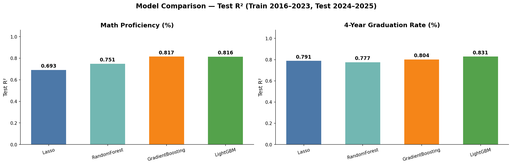

### Math Proficiency (%)

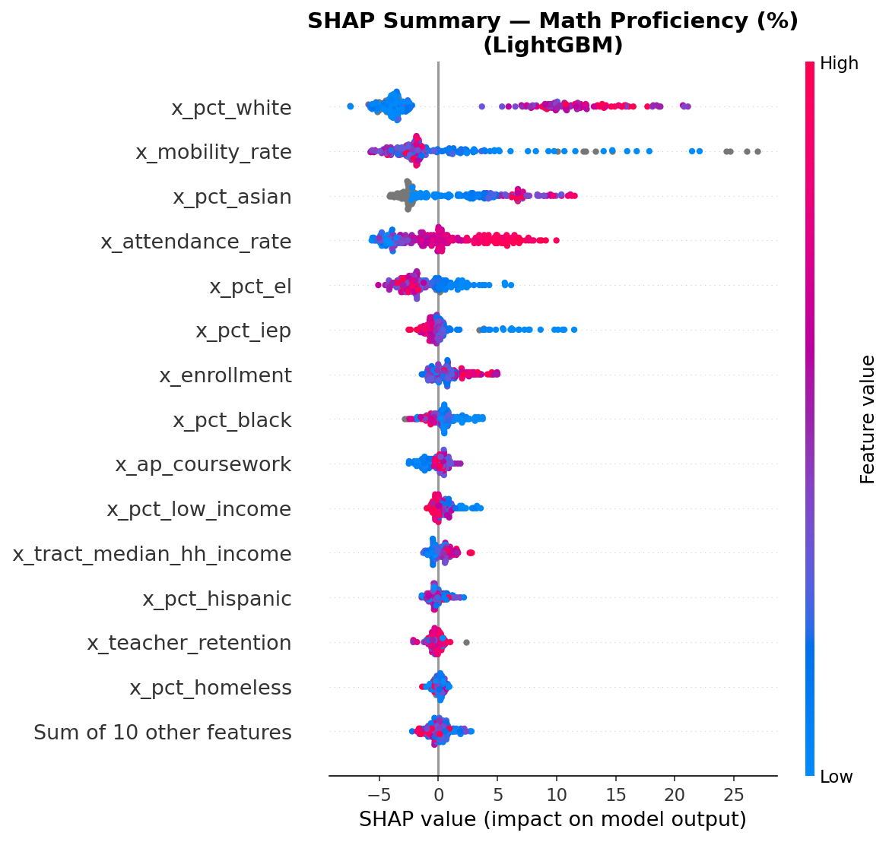

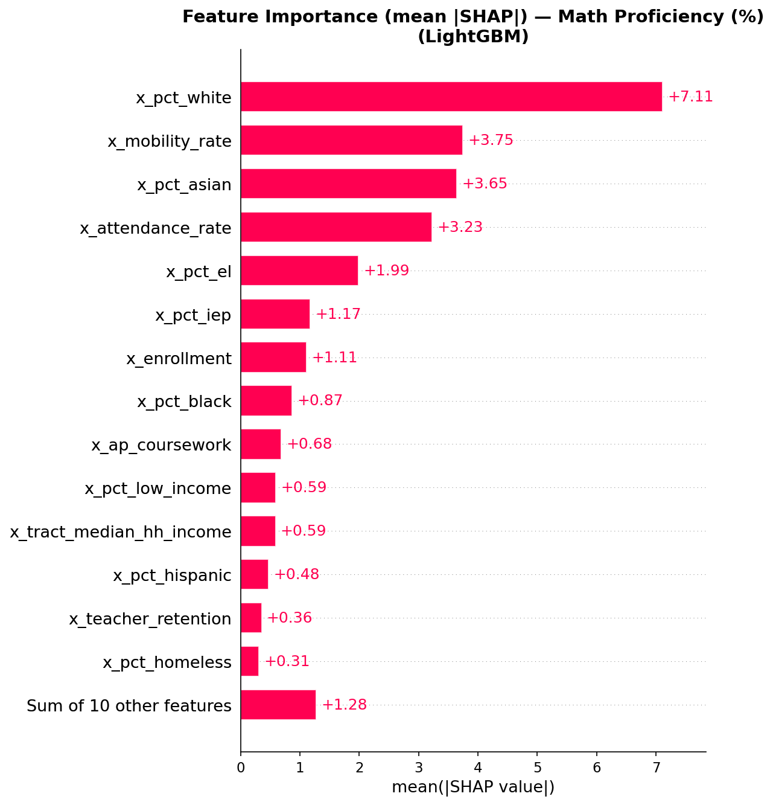

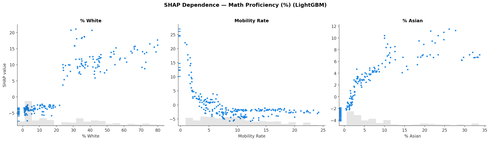

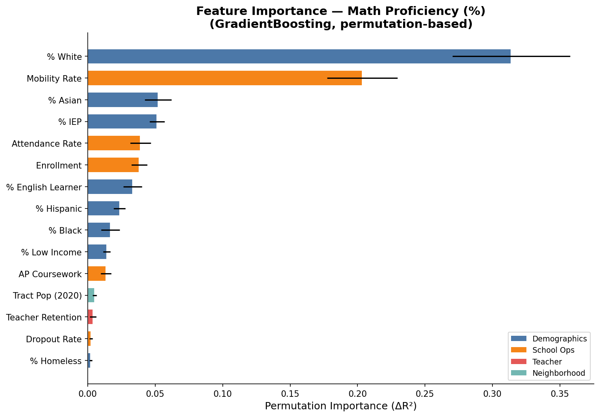

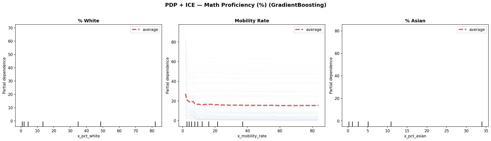

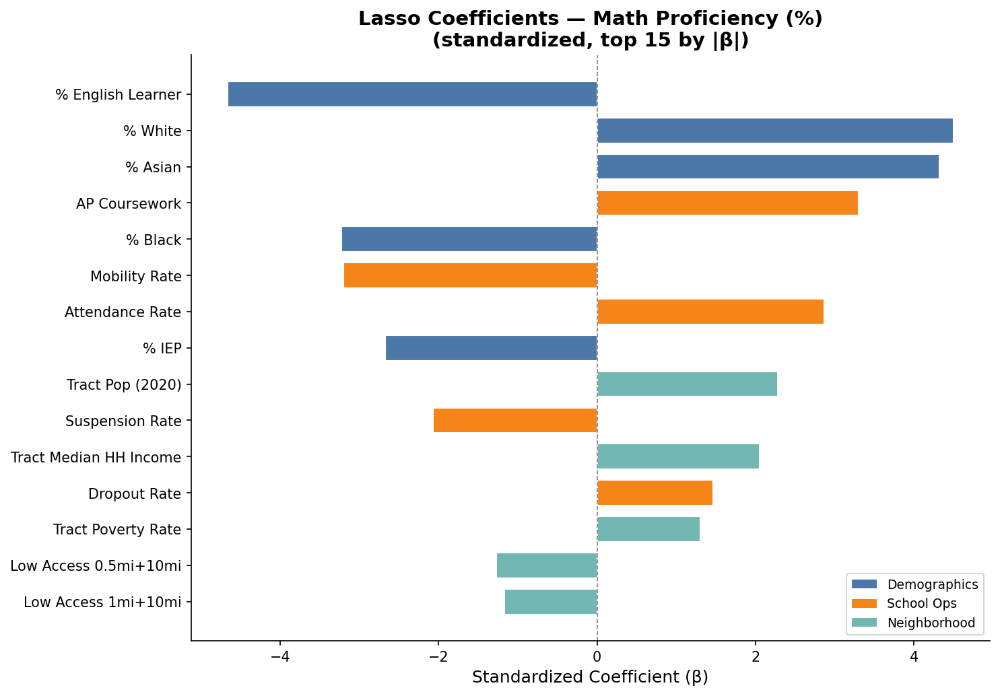

### 4-Year Graduation Rate (%)

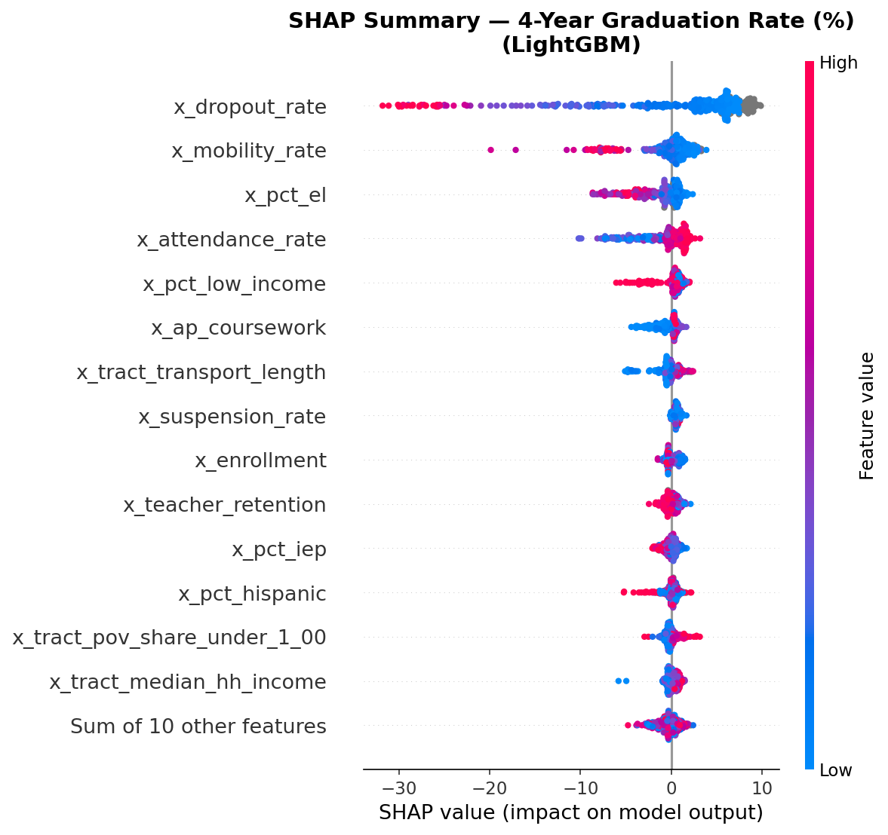

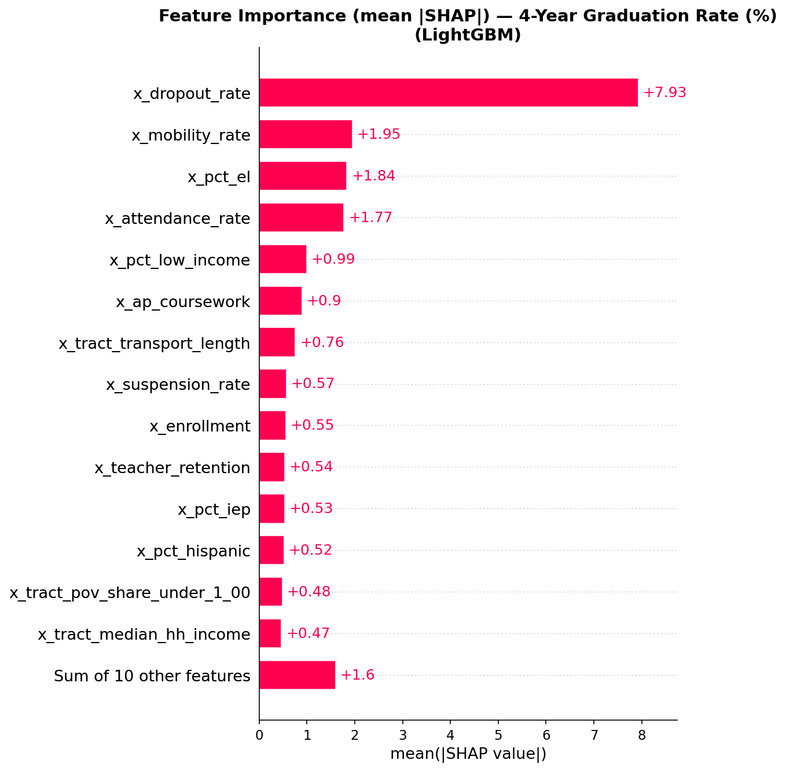

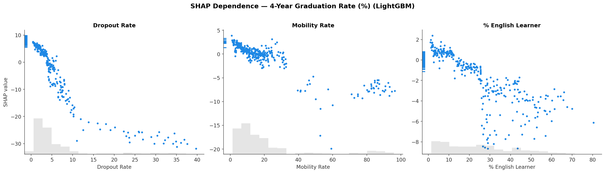

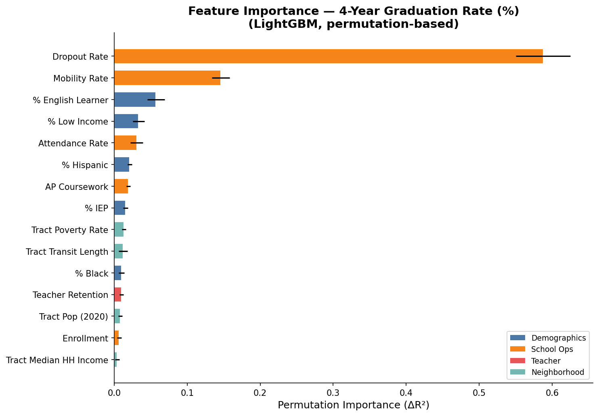

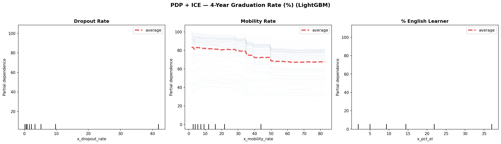

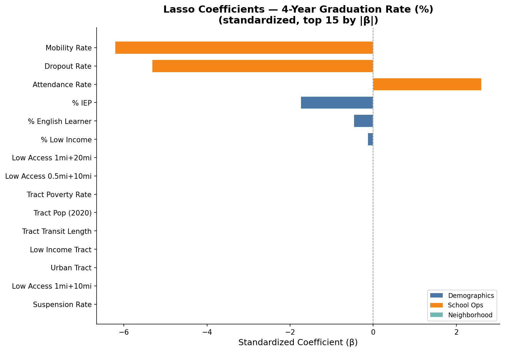

## Methodology

### Train/Test Split

- **Temporal split**: Train = school years 2016–2023, Test = 2024–2025
- Rationale: simulates real-world use case — predict future school performance from historical data
- This is a **time-based out-of-sample** test, which is stricter and more realistic than random splits for panel data

### Cross-Validation

- 5-fold **GroupKFold** grouped by `school_id`
- Prevents data leakage: the same school never appears in both train and validation fold
- This controls for school-level autocorrelation

### Models

- **Lasso**: L1-regularized linear regression (median imputation + standardization)
- **RandomForest**: 300 trees, max_depth=12 (median imputation)
- **GradientBoosting**: sklearn HistGradientBoostingRegressor (handles NaN natively)
- **LightGBM**: gradient boosting (handles NaN natively, SHAP source)

### Interpretability

- **SHAP** (from LightGBM): TreeExplainer gives exact Shapley values
- **Permutation Importance**: model-agnostic, from best model
- **PDP/ICE**: shows marginal effect of top features
- **Lasso coefficients**: standardized β gives linear effect direction + magnitude